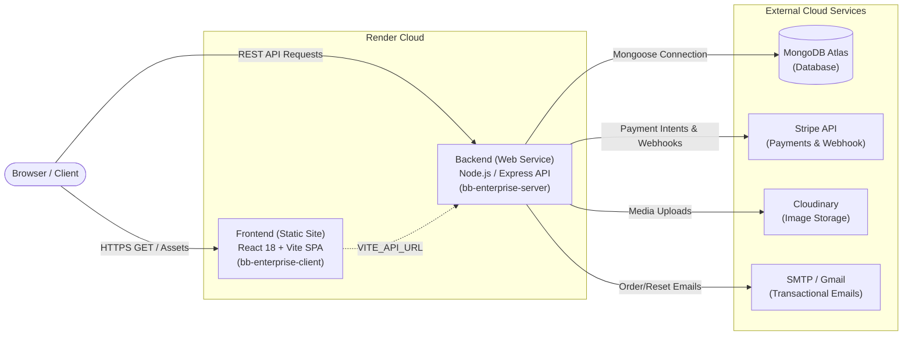

# 🚀 Render Deployment & Hosting Guide — BB Enterprise

A comprehensive, step-by-step production hosting guide for deploying **BB Enterprise** on [Render](https://render.com/).

---

## 📋 Architecture Overview

BB Enterprise consists of two decoupled components:



| Component | Render Service Type | Root Directory | Build Command | Start / Publish |
| :--- | :--- | :--- | :--- | :--- |
| **Backend API** | **Web Service** | `server` | `npm install` | `npm start` (`node src/index.js`) |
| **Frontend UI** | **Static Site** | `client` | `npm install && npm run build` | `dist` |

---

## 🛠️ Prerequisites & External Accounts

Before starting deployment on Render, ensure you have:

1. **Git Repository**: Code pushed to GitHub or GitLab.
2. **Render Account**: [Sign up for free at render.com](https://render.com/).
3. **MongoDB Atlas Account**: [Create a free M0 cluster at mongodb.com](https://www.mongodb.com/cloud/atlas).
4. *(Optional / Recommended)* **Stripe Account**: [Stripe Dashboard](https://dashboard.stripe.com/) for test/live API keys.
5. *(Optional / Recommended)* **Cloudinary Account**: [Cloudinary Console](https://cloudinary.com/) for media storage.
6. *(Optional)* **Gmail / SMTP Account**: For password reset & confirmation emails.

---

## 🗄️ Step 1: Set Up MongoDB Atlas (Database)

1. **Create an Atlas Cluster**:
   - Go to [MongoDB Atlas](https://cloud.mongodb.com/) and create a free Shared Cluster (M0).
2. **Create a Database User**:
   - Navigate to **Security > Database Access**.
   - Click **Add New Database User**.
   - Select **Password** authentication (e.g., username `bb_admin`, set a strong password).
   - Assign user privileges: **Read and write to any database**.
3. **Configure Network Access**:
   - Navigate to **Security > Network Access**.
   - Click **Add IP Address**.
   - Choose **Allow Access from Anywhere** (`0.0.0.0/0`) — required because Render free instances use dynamic IPs.
4. **Get Connection String**:
   - Go to **Database > Clusters** and click **Connect**.
   - Select **Drivers** (Node.js).
   - Copy the connection string. Format:
     ```text
     mongodb+srv://<username>:<password>@<cluster-url>.mongodb.net/bb_enterprise?retryWrites=true&w=majority
     ```
   *(Note: Replace `<username>` and `<password>` with your database user credentials. If your password has special characters, URL-encode them).*

---

## ⚙️ Step 2: Deploy Backend Web Service on Render

### 2.1 Create the Web Service

1. Log in to [Render Dashboard](https://dashboard.render.com/).
2. Click **New +** > **Web Service**.
3. Connect your Git repository (`sumanpanja2005/BB-Enterprise`).
4. Configure the service settings:

| Setting | Value |
| :--- | :--- |
| **Name** | `bb-enterprise-server` (or your preferred name) |
| **Region** | Choose the region closest to you (e.g., Singapore, Frankfurt, Oregon) |
| **Branch** | `main` (or default branch) |
| **Root Directory** | `server` |
| **Runtime** | `Node` |
| **Build Command** | `npm install` |
| **Start Command** | `npm start` |
| **Instance Type** | `Free` |

5. Expand **Advanced** and set:
   - **Health Check Path**: `/api/health`
   - **Auto-Deploy**: `Yes`

---

### 2.2 Configure Backend Environment Variables

In the **Environment Variables** section of your Web Service, add the following key-value pairs:

| Variable | Recommended / Required Value | Description |
| :--- | :--- | :--- |
| `NODE_ENV` | `production` | Enables production mode |
| `PORT` | `10000` *(Render sets this automatically)* | Port Express binds to |
| `MONGODB_URI` | `mongodb+srv://<user>:<pwd>@cluster.mongodb.net/bb_enterprise?retryWrites=true&w=majority` | MongoDB Atlas URI |
| `JWT_SECRET` | *(64-character random string)* | Secret for signing JWT auth tokens |
| `JWT_EXPIRES_IN` | `7d` | Token validity duration |
| `FRONTEND_URL` | `https://bb-enterprise-client.onrender.com` | Primary URL of the frontend (update after Step 3) |
| `CORS_ORIGINS` | `https://your-custom-domain.com` *(optional)* | Extra allowed origins (comma-separated) |
| `STRIPE_SECRET_KEY` | `sk_test_...` or `sk_live_...` | Stripe API Secret Key |
| `STRIPE_WEBHOOK_SECRET` | `whsec_...` | Stripe Webhook signing secret |
| `CLOUDINARY_CLOUD_NAME` | `your_cloudinary_cloud_name` | Cloudinary storage account name |
| `CLOUDINARY_API_KEY` | `your_cloudinary_api_key` | Cloudinary API Key |
| `CLOUDINARY_API_SECRET` | `your_cloudinary_api_secret` | Cloudinary API Secret |
| `EMAIL_HOST` | `smtp.gmail.com` | SMTP Server Host |
| `EMAIL_PORT` | `587` | SMTP Port |
| `EMAIL_USER` | `your-email@gmail.com` | SMTP Username |
| `EMAIL_PASS` | `your-16-char-app-password` | Gmail App Password (not standard account password) |
| `EMAIL_FROM` | `"BB Enterprise <noreply@bbenterprise.com>"` | Outgoing sender email address |

> **Tip to generate a secure `JWT_SECRET`:**
> Run in your local terminal:
> ```bash
> node -e "console.log(require('crypto').randomBytes(64).toString('hex'))"
> ```

6. Click **Create Web Service**. Wait for the build and deployment to finish.
7. Once deployed, note down your Backend API URL:
   `https://bb-enterprise-server.onrender.com`

---

## 💻 Step 3: Deploy Frontend Static Site on Render

### 3.1 Create the Static Site

1. In Render Dashboard, click **New +** > **Static Site**.
2. Connect the same Git repository (`sumanpanja2005/BB-Enterprise`).
3. Configure the static site settings:

| Setting | Value |
| :--- | :--- |
| **Name** | `bb-enterprise-client` (or your preferred name) |
| **Branch** | `main` |
| **Root Directory** | `client` |
| **Build Command** | `npm install && npm run build` |
| **Publish Directory** | `dist` |
| **Auto-Deploy** | `Yes` |

---

### 3.2 Add Frontend Environment Variables

Under **Environment Variables**, add:

| Key | Value | Notes |
| :--- | :--- | :--- |
| `VITE_API_URL` | `https://bb-enterprise-server.onrender.com` | Your deployed backend URL from Step 2 |

> ⚠️ **Important:** Vite injects `VITE_*` variables at **build time**. If you change `VITE_API_URL` later, you must trigger a manual **Clear build cache & deploy** on Render for changes to apply.

---

### 3.3 Configure Single Page Application (SPA) Rewrite Rule

Because BB Enterprise uses **React Router (`react-router-dom`)**, direct URL navigation (e.g. visiting `/products/xyz` or refreshing `/admin`) will return a 404 error unless a rewrite rule is configured.

1. Go to your Static Site's settings in Render.
2. Click on the **Redirects / Rewrites** tab in the sidebar.
3. Click **Add Rule** and enter:

| Field | Value |
| :--- | :--- |
| **Type** | `Rewrite` |
| **Source** | `/*` |
| **Destination** | `/index.html` |
| **Action** | `Rewrite` (Status `200`) |

4. Click **Save Changes**.

5. Note down your Frontend URL:
   `https://bb-enterprise-client.onrender.com`

---

## 🔄 Step 4: Link Frontend URL to Backend CORS

Now that you have your live frontend URL:

1. Return to the **Backend Web Service (`bb-enterprise-server`)** on Render.
2. Go to **Environment**.
3. Update `FRONTEND_URL` to match your actual frontend domain:
   ```text
   FRONTEND_URL=https://bb-enterprise-client.onrender.com
   ```
4. Render will automatically re-deploy the backend with the new CORS origin.

*(Note: The BB Enterprise backend also automatically allows all `*.onrender.com` subdomains by default).*

---

## 🌱 Step 5: Initialize & Seed the Production Database

To populate your production database with initial categories, demo products, store locations, and the default admin account:

### Option A: Seed Remotely from Your Local Machine (Easiest)

1. On your local machine, open `server/.env`.
2. Temporarily set `MONGODB_URI` to your **MongoDB Atlas production connection string**.
3. In the terminal, run:
   ```bash
   cd server
   npm run seed
   ```
4. Output will confirm seeded products, categories, reviews, and admin account:
   - **Admin Email**: `admin@bbenterprise.com`
   - **Admin Password**: `Admin123!`
5. Revert your local `server/.env` back to your local development database if needed.

### Option B: Seed via Render One-Off Command / Deploy Hook

You can run a one-off seed job using Render's CLI or Shell (on paid instances) or via a temporary start script:
```bash
node src/seed/seedData.js && node src/index.js
```

---

## 💳 Step 6: Configure Stripe Webhooks (Production)

To handle checkout fulfillment and payment verification:

1. Go to [Stripe Dashboard > Developers > Webhooks](https://dashboard.stripe.com/webhooks).
2. Click **Add Endpoint**.
3. **Endpoint URL**:
   ```text
   https://bb-enterprise-server.onrender.com/api/payments/webhook
   ```
4. **Events to listen for**:
   - `checkout.session.completed`
   - `payment_intent.succeeded`
   - `payment_intent.payment_failed`
5. Click **Add Endpoint**.
6. Reveal the **Signing secret** (`whsec_...`) and paste it as `STRIPE_WEBHOOK_SECRET` in your Backend's Environment Variables on Render.

---

## ⚡ Step 7 (Alternative): Infrastructure as Code via `render.yaml` (Blueprint)

Render supports deploying both frontend and backend automatically using a single `render.yaml` Blueprint file located in the root of the repository.

### `render.yaml` Blueprint File

```yaml
services:
  # ----------------------------------------------------
  # Backend Express Web Service
  # ----------------------------------------------------
  - type: web
    name: bb-enterprise-server
    runtime: node
    plan: free
    rootDir: server
    buildCommand: npm install
    startCommand: npm start
    healthCheckPath: /api/health
    envVars:
      - key: NODE_ENV
        value: production
      - key: PORT
        value: 10000
      - key: MONGODB_URI
        sync: false
      - key: JWT_SECRET
        generateValue: true
      - key: JWT_EXPIRES_IN
        value: 7d
      - key: FRONTEND_URL
        fromService:
          type: static
          name: bb-enterprise-client
          property: host
      - key: STRIPE_SECRET_KEY
        sync: false
      - key: STRIPE_WEBHOOK_SECRET
        sync: false
      - key: CLOUDINARY_CLOUD_NAME
        sync: false
      - key: CLOUDINARY_API_KEY
        sync: false
      - key: CLOUDINARY_API_SECRET
        sync: false
      - key: EMAIL_HOST
        value: smtp.gmail.com
      - key: EMAIL_PORT
        value: 587
      - key: EMAIL_USER
        sync: false
      - key: EMAIL_PASS
        sync: false
      - key: EMAIL_FROM
        value: "BB Enterprise <noreply@bbenterprise.com>"

  # ----------------------------------------------------
  # Frontend Vite React Static Site
  # ----------------------------------------------------
  - type: static
    name: bb-enterprise-client
    plan: free
    rootDir: client
    buildCommand: npm install && npm run build
    staticPublishPath: dist
    routes:
      - type: rewrite
        source: /*
        destination: /index.html
    envVars:
      - key: VITE_API_URL
        fromService:
          type: web
          name: bb-enterprise-server
          property: host
```

### To deploy via Blueprint:
1. Push `render.yaml` to your Git repository.
2. Go to [Render Dashboard](https://dashboard.render.com/) > **Blueprints** > **New Blueprint Instance**.
3. Select your repository. Render will automatically read `render.yaml`, generate secrets, and prompt for un-synced variables (`MONGODB_URI`, `STRIPE_SECRET_KEY`, etc.).
4. Click **Apply**.

---

## ⏰ Free Tier Cold Start & Keep-Alive Solutions

On Render's Free tier:
- Free Web Services **spin down after 15 minutes** of inactivity.
- The first request after spin-down takes **30–50 seconds** to wake up the server.
- Static sites (frontend) are **always instant** (hosted on CDN with 0s latency).

### Recommended Keep-Alive Setup (Optional Free Monitor):
1. Create a free account on [UptimeRobot](https://uptimerobot.com/) or [cron-job.org](https://cron-job.org/).
2. Create a new **HTTP(s) Monitor**:
   - **URL**: `https://bb-enterprise-server.onrender.com/api/health`
   - **Interval**: Every **10 minutes**
3. This prevents the backend from sleeping during daytime hours.

---

## 🩺 Verification & Health Check

After completing deployment:

| Check | URL / Step | Expected Result |
| :--- | :--- | :--- |
| **API Root** | `GET https://<backend>/` | `{"ok":true,"service":"BB Enterprise API",...}` |
| **Health Check** | `GET https://<backend>/api/health` | `{"ok":true,"service":"BB Enterprise API"}` |
| **Product List** | `GET https://<backend>/api/products` | JSON list of cosmetic products |
| **Frontend Home** | `https://<frontend>/` | Renders the hero banner, cosmetic cards & navigation |
| **SPA Deep Routing** | Visit `https://<frontend>/products` and refresh | Page loads properly without 404 error |
| **Admin Login** | Login with `admin@bbenterprise.com` / `Admin123!` | Successfully navigates to Admin Dashboard |
| **Image Uploads** | Upload a new product image in Admin panel | Image uploads to Cloudinary and displays |

---

## 🔍 Troubleshooting Common Deployment Issues

### 1. `404 Not Found` on Page Refresh or Deep Links
- **Cause**: React Router handles client routes in the browser. A direct request for `/login` asks Render for a literal file named `login`, which does not exist.
- **Fix**: Add the Static Site rewrite rule:
  - Source: `/*`
  - Destination: `/index.html`
  - Action: `Rewrite`

### 2. `CORS blocked for origin: https://...`
- **Cause**: `FRONTEND_URL` on the backend is either empty or does not match the frontend domain.
- **Fix**: Ensure `FRONTEND_URL` in the backend environment variables equals `https://<your-frontend-subdomain>.onrender.com` (no trailing slash).

### 3. MongoDB Connection Timeout / `MongooseServerSelectionError`
- **Cause**: Atlas network access IP whitelist does not allow incoming traffic from Render.
- **Fix**: In MongoDB Atlas, go to **Network Access** > **Add IP Address** > select **Allow access from anywhere (`0.0.0.0/0`)**.

### 4. Stripe Webhook Verification Failed (`400 Bad Request`)
- **Cause**: The Stripe webhook endpoint requires the unparsed, raw request payload for cryptographic signature verification.
- **Fix**: The BB Enterprise server already registers `express.raw()` for `/api/payments/webhook` before `express.json()`. Ensure your `STRIPE_WEBHOOK_SECRET` matches the secret generated in Stripe Dashboard for that specific endpoint.

### 5. Frontend Still Requests `localhost:5000` in Production
- **Cause**: `VITE_API_URL` was missing or added after the build.
- **Fix**: Set `VITE_API_URL=https://bb-enterprise-server.onrender.com` in Frontend Environment Variables and trigger **Manual Deploy > Clear build cache & deploy**.

---

## 📄 License & Maintenance

BB Enterprise is built for scalable eCommerce. For updates, push commits to the linked Git repository branch to trigger Render's automated Continuous Deployment (CD).
